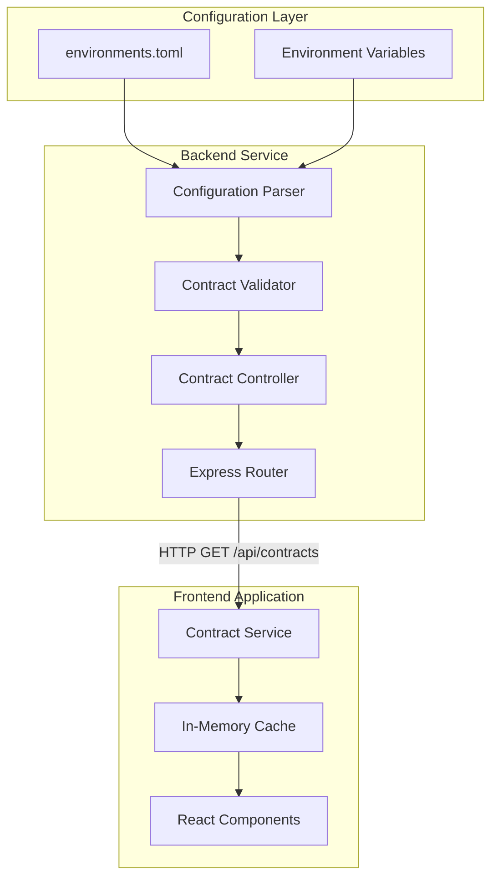

# Design Document: Contract Address Registry API

## Overview

The Contract Address Registry API provides a centralized, configuration-driven system for managing and serving Soroban smart contract deployment information. The system consists of two primary components:

1. **Backend API Service**: A REST endpoint that reads contract addresses from server-side configuration (environments.toml or environment variables) and exposes them through a structured JSON API
2. **Frontend Contract Service**: A TypeScript service module that fetches, caches, and provides type-safe access to contract addresses throughout the React application

This design decouples contract deployment information from the frontend build process, enabling zero-downtime contract updates and supporting multiple network environments (testnet/mainnet) without code changes.

### Key Design Goals

- Configuration-driven contract management (no hardcoded addresses)
- Hot-swappable contract deployments without frontend rebuilds
- Type-safe contract access in the frontend
- Efficient caching to minimize API calls
- Comprehensive error handling and logging
- Backward compatibility with existing systems
- Support for dynamic contract discovery

## Architecture

### System Components



### Data Flow

1. **Startup**: Backend reads and parses environments.toml or environment variables
2. **Validation**: Contract IDs are validated against Stellar address format
3. **API Request**: Frontend calls GET /api/contracts on initialization
4. **Caching**: Frontend stores response in memory for subsequent access
5. **Access**: Components retrieve contract IDs through service methods
6. **Refresh**: Cache can be manually refreshed or auto-refreshes after TTL

### Technology Stack

**Backend**:

- Node.js with Express.js
- TypeScript for type safety
- TOML parser for configuration files
- Winston for structured logging

**Frontend**:

- React with TypeScript
- Axios for HTTP requests
- In-memory caching with TTL support

## Components and Interfaces

### Backend Components

#### 1. Configuration Parser Service

**Location**: `backend/src/services/contractConfigService.ts`

**Responsibilities**:

- Parse environments.toml file structure
- Fall back to environment variables if TOML unavailable
- Extract contract entries from staging/production sections
- Map TOML structure to internal data model

**Key Methods**:

```typescript
class ContractConfigService {
  parseTomlConfig(): ContractEntry[];
  parseEnvVarConfig(): ContractEntry[];
  getContractEntries(): ContractEntry[];
}
```

**Configuration Mapping**:

- TOML: `[staging.contracts]` → testnet entries
- TOML: `[production.contracts]` → mainnet entries
- Env Vars: `{CONTRACT_TYPE}_{NETWORK}_CONTRACT_ID` pattern

#### 2. Contract Validator

**Location**: `backend/src/utils/contractValidator.ts`

**Responsibilities**:

- Validate Stellar contract address format (C + 56 alphanumeric chars)
- Validate required fields presence
- Log validation warnings for incomplete entries

**Validation Rules**:

```typescript
interface ValidationRules {
  contractId: /^C[A-Z0-9]{56}$/
  network: ['testnet', 'mainnet']
  contractType: ['bulk_payment', 'vesting_escrow', 'revenue_split', 'cross_asset_payment']
  version: string (semver format recommended)
  deployedAt: positive integer
}
```

#### 3. Contract Controller

**Location**: `backend/src/controllers/contractController.ts`

**Responsibilities**:

- Handle GET /api/contracts requests
- Coordinate between config service and validator
- Format response according to schema
- Handle errors and return appropriate HTTP status codes

**Controller Structure**:

```typescript
export class ContractController {
  static async getContracts(req: Request, res: Response): Promise<void> {
    // 1. Fetch contract entries from config service
    // 2. Validate entries
    // 3. Format response with timestamp and count
    // 4. Set appropriate headers (CORS, Cache-Control, Content-Type)
    // 5. Return JSON response
  }
}
```

#### 4. Contract Routes

**Location**: `backend/src/routes/contractRoutes.ts`

**Route Definition**:

```typescript
router.get("/contracts", ContractController.getContracts);
```

**Middleware Stack**:

- CORS enabled for cross-origin requests
- No authentication required (public endpoint)
- Request logging via Morgan
- Error handling middleware

### Frontend Components

#### 1. Contract Service

**Location**: `frontend/src/services/contracts.ts`

**Responsibilities**:

- Fetch contract registry from backend API
- Cache registry data in memory
- Provide type-safe access methods
- Handle retry logic with exponential backoff
- Support manual cache refresh

**Service Interface**:

```typescript
class ContractService {
  private cache: ContractRegistry | null;
  private lastFetch: number | null;
  private readonly CACHE_TTL = 3600000; // 1 hour

  async initialize(): Promise<void>;
  async fetchRegistry(): Promise<ContractRegistry>;
  getContractId(contractType: string, network: string): string | null;
  async refreshRegistry(): Promise<void>;
  isCacheValid(): boolean;
}
```

**Retry Strategy**:

- Maximum 3 retry attempts
- Exponential backoff: 1s, 2s, 4s
- Throw descriptive error after all retries fail

#### 2. Contract Types

**Location**: `frontend/src/services/contracts.types.ts`

**Type Definitions**:

```typescript
export interface ContractEntry {
  contractId: string;
  network: "testnet" | "mainnet";
  contractType:
    | "bulk_payment"
    | "vesting_escrow"
    | "revenue_split"
    | "cross_asset_payment";
  version: string;
  deployedAt: number;
}

export interface ContractRegistry {
  contracts: ContractEntry[];
  timestamp: string;
  count: number;
}

export type NetworkType = "testnet" | "mainnet";
export type ContractType =
  | "bulk_payment"
  | "vesting_escrow"
  | "revenue_split"
  | "cross_asset_payment";
```

## Data Models

### Contract Entry Model

```typescript
interface ContractEntry {
  contractId: string; // Stellar contract address (C + 56 chars)
  network: string; // "testnet" | "mainnet"
  contractType: string; // Contract identifier
  version: string; // Version string (e.g., "1.0.0")
  deployedAt: number; // Ledger sequence number
}
```

### API Response Model

```typescript
interface ContractRegistryResponse {
  contracts: ContractEntry[]; // Array of contract entries
  timestamp: string; // ISO 8601 timestamp
  count: number; // Total number of contracts
}
```

### Configuration Models

**TOML Structure**:

```toml
[staging.contracts]
bulk_payment = { id = "CABC...", version = "1.0.0", deployed_at = 12345 }
vesting_escrow = { id = "CDEF...", version = "1.0.0", deployed_at = 12346 }

[production.contracts]
bulk_payment = { id = "CXYZ...", version = "1.0.0", deployed_at = 54321 }
```

**Environment Variable Pattern**:

```bash
BULK_PAYMENT_TESTNET_CONTRACT_ID=CABC...
BULK_PAYMENT_TESTNET_VERSION=1.0.0
BULK_PAYMENT_TESTNET_DEPLOYED_AT=12345

BULK_PAYMENT_MAINNET_CONTRACT_ID=CXYZ...
BULK_PAYMENT_MAINNET_VERSION=1.0.0
BULK_PAYMENT_MAINNET_DEPLOYED_AT=54321
```

## Correctness Properties

_A property is a characteristic or behavior that should hold true across all valid executions of a system—essentially, a formal statement about what the system should do. Properties serve as the bridge between human-readable specifications and machine-verifiable correctness guarantees._

### Property 1: Response Contains Contracts Array

_For any_ successful API request to /api/contracts, the response SHALL contain a "contracts" property that is an array.

**Validates: Requirements 2.1, 6.1**

### Property 2: Contract Entries Have Required Fields

_For any_ contract entry in the API response, the entry SHALL include all required fields (contractId, network, contractType, version, deployedAt) with correct types (contractId as string, network as "testnet" or "mainnet", contractType as string, version as string, deployedAt as positive integer).

**Validates: Requirements 2.2, 2.3, 2.4, 2.5, 2.6**

### Property 3: Response Structure Consistency

_For any_ successful API response, the response SHALL include a "contracts" array, a "timestamp" field in ISO 8601 format, and a "count" field that equals the length of the contracts array.

**Validates: Requirements 6.1, 6.2, 6.3**

### Property 4: Contract ID Format Validation

_For any_ contract ID in the system, if it passes validation, it SHALL match the Stellar contract address format (starting with 'C' followed by exactly 56 alphanumeric characters).

**Validates: Requirements 3.7**

### Property 5: Environment Variable Parsing

_For any_ set of environment variables following the naming patterns ({CONTRACT*TYPE}*{NETWORK}_CONTRACT_ID, {CONTRACT_TYPE}_{NETWORK}_VERSION, {CONTRACT_TYPE}_{NETWORK}\_DEPLOYED_AT), the parser SHALL correctly extract and map them to contract entries.

**Validates: Requirements 3.3, 3.4, 3.5**

### Property 6: Dynamic Contract Discovery

_For any_ valid contract entry added to the configuration source (environments.toml or environment variables) with all required fields, the API SHALL include that contract in the response without code modifications.

**Validates: Requirements 5.1, 5.2**

### Property 7: Cache Retrieval Consistency

_For any_ contract that has been cached by the Contract Service, calling getContractId(contractType, network) SHALL return the same contract ID that was in the original API response, without making additional network requests.

**Validates: Requirements 4.4, 9.2**

### Property 8: Configuration Source Fallback

_For any_ system state where environments.toml is unavailable, the API SHALL successfully read contract addresses from environment variables and return a valid response.

**Validates: Requirements 3.2**

## Error Handling

### Backend Error Handling Strategy

**Configuration Errors**:

- Missing environments.toml: Fall back to environment variables
- Malformed TOML: Return HTTP 500 with descriptive error message
- Missing environment variables: Return HTTP 500 indicating no configuration source

**Validation Errors**:

- Invalid contract ID format: Log warning, omit entry from response
- Missing required fields: Log warning, omit entry from response
- Invalid network value: Log warning, omit entry from response

**Runtime Errors**:

- File system errors: Log error, attempt env var fallback
- Parsing errors: Log error with file path and line number, return HTTP 500

**Error Response Format**:

```typescript
interface ErrorResponse {
  error: string; // Error type/category
  message: string; // Human-readable description
  timestamp: string; // ISO 8601 timestamp
  path?: string; // File path if applicable
  details?: unknown; // Additional error context
}
```

**HTTP Status Codes**:

- 200: Successful response with contract data
- 500: Server error (configuration unavailable, parsing failed, validation failed)
- 404: Route not found (handled by Express)

### Frontend Error Handling Strategy

**Network Errors**:

- Connection failures: Retry with exponential backoff (1s, 2s, 4s)
- Timeout errors: Retry up to 3 times
- HTTP 500 responses: Retry up to 3 times

**Retry Logic**:

```typescript
async function fetchWithRetry(maxRetries = 3): Promise<ContractRegistry> {
  for (let attempt = 1; attempt <= maxRetries; attempt++) {
    try {
      return await axios.get("/api/contracts");
    } catch (error) {
      if (attempt === maxRetries) {
        throw new Error(
          `Failed to fetch contracts after ${maxRetries} attempts: ${error.message}`,
        );
      }
      await sleep(Math.pow(2, attempt - 1) * 1000);
    }
  }
}
```

**Cache Errors**:

- Cache miss: Fetch from API
- Stale cache (> 1 hour): Auto-refresh on next access
- Invalid cached data: Clear cache, re-fetch

**Validation Errors**:

- Invalid response schema: Throw error with schema validation details
- Missing contract ID: Return null from getContractId()
- Invalid parameters: Throw TypeError with parameter requirements

**Error Propagation**:

- Service initialization errors: Throw to prevent app startup with invalid state
- Runtime errors: Log to console, return null/undefined for graceful degradation
- Critical errors: Bubble up to ErrorBoundary component

### Logging Strategy

**Backend Logging Levels**:

- ERROR: Configuration parsing failures, file system errors, unhandled exceptions
- WARN: Invalid contract entries, missing fields, validation failures
- INFO: Successful configuration load, contract count, API requests
- DEBUG: Detailed parsing steps, validation checks

**Log Format**:

```typescript
{
  level: 'info' | 'warn' | 'error' | 'debug',
  message: string,
  timestamp: string,
  correlationId: string,
  context: {
    component: 'ContractConfigService' | 'ContractController',
    action: string,
    details: unknown
  }
}
```

**Frontend Logging**:

- Console errors for fetch failures with HTTP status
- Console warnings for cache invalidation
- Console info for successful initialization (development only)

## Testing Strategy

### Dual Testing Approach

This feature requires both unit tests and property-based tests to ensure comprehensive coverage:

**Unit Tests**: Verify specific examples, edge cases, and error conditions

- Specific configuration file structures
- Known contract address formats
- Error scenarios with missing/malformed data
- Integration between components

**Property Tests**: Verify universal properties across all inputs

- Contract ID validation across random inputs
- Response structure consistency across different configurations
- Cache behavior across multiple access patterns
- Configuration parsing across various valid formats

Both testing approaches are complementary and necessary. Unit tests catch concrete bugs in specific scenarios, while property tests verify general correctness across a wide input space.

### Backend Testing

**Unit Tests** (`backend/src/__tests__/contractController.test.ts`):

- GET /api/contracts returns 200 with valid TOML config
- GET /api/contracts returns 200 with valid env vars
- GET /api/contracts returns 500 when no config available
- Response includes CORS headers
- Response includes Cache-Control header with max-age=3600
- Response Content-Type is application/json
- Invalid contract IDs are filtered from response
- Entries with missing required fields are omitted

**Unit Tests** (`backend/src/__tests__/contractConfigService.test.ts`):

- Parse valid environments.toml with staging contracts
- Parse valid environments.toml with production contracts
- Fall back to env vars when TOML missing
- Extract contracts from [staging.contracts] section
- Extract contracts from [production.contracts] section
- Handle malformed TOML gracefully

**Unit Tests** (`backend/src/__tests__/contractValidator.test.ts`):

- Valid Stellar contract address passes validation
- Invalid format (wrong prefix) fails validation
- Invalid format (wrong length) fails validation
- Missing required fields fails validation
- Invalid network value fails validation

**Property-Based Tests** (`backend/src/__tests__/contractProperties.test.ts`):

Each property test should run a minimum of 100 iterations and include a comment tag referencing the design document property.

```typescript
// Feature: contract-address-registry-api, Property 2: Contract Entries Have Required Fields
test("all contract entries have required fields with correct types", async () => {
  // Generate random valid configuration
  // Call API
  // Verify all entries have contractId, network, contractType, version, deployedAt
  // Verify types are correct
});

// Feature: contract-address-registry-api, Property 3: Response Structure Consistency
test("response structure is consistent", async () => {
  // Generate random valid configuration
  // Call API
  // Verify response has contracts array, timestamp, and count
  // Verify count equals contracts.length
  // Verify timestamp is valid ISO 8601
});

// Feature: contract-address-registry-api, Property 4: Contract ID Format Validation
test("contract ID validation enforces Stellar format", async () => {
  // Generate random contract IDs (valid and invalid)
  // Validate each
  // Verify valid ones pass, invalid ones fail
  // Verify format: C + 56 alphanumeric chars
});

// Feature: contract-address-registry-api, Property 5: Environment Variable Parsing
test("environment variables are parsed correctly", async () => {
  // Generate random env vars following naming pattern
  // Parse configuration
  // Verify all contracts are extracted correctly
  // Verify field mapping is correct
});

// Feature: contract-address-registry-api, Property 6: Dynamic Contract Discovery
test("new contracts are discovered dynamically", async () => {
  // Generate random contract entries
  // Add to configuration
  // Call API
  // Verify all entries appear in response
});
```

### Frontend Testing

**Unit Tests** (`frontend/src/services/__tests__/contracts.test.ts`):

- initialize() fetches from /api/contracts
- getContractId() returns correct ID for cached contract
- getContractId() returns null for non-existent contract
- refreshRegistry() fetches fresh data
- Retry logic attempts 3 times on failure
- Exponential backoff delays are correct (1s, 2s, 4s)
- Error thrown after 3 failed retries
- Cache TTL expires after 1 hour

**Property-Based Tests** (`frontend/src/services/__tests__/contractProperties.test.ts`):

```typescript
// Feature: contract-address-registry-api, Property 7: Cache Retrieval Consistency
test("cached contracts are retrieved consistently", async () => {
  // Generate random contract registry
  // Initialize service with mock response
  // For each contract, call getContractId()
  // Verify returned ID matches original
  // Verify no additional network requests made
});

// Feature: contract-address-registry-api, Property 8: Configuration Source Fallback
test("fallback to environment variables works", async () => {
  // Simulate missing TOML file
  // Set random environment variables
  // Call API
  // Verify response contains contracts from env vars
});
```

**Integration Tests** (`frontend/src/services/__tests__/contracts.integration.test.ts`):

- End-to-end: Start backend, initialize frontend service, verify contract access
- Cache refresh: Verify cache updates after TTL expiration
- Error recovery: Simulate backend failure, verify retry and recovery

### Property-Based Testing Configuration

**Library Selection**:

- Backend: `fast-check` (TypeScript/JavaScript property-based testing library)
- Frontend: `fast-check` (same library for consistency)

**Test Configuration**:

```typescript
import fc from "fast-check";

fc.assert(
  fc.property(
    // Arbitrary generators here
    (generatedData) => {
      // Property assertion
    },
  ),
  { numRuns: 100 }, // Minimum 100 iterations
);
```

**Custom Generators**:

```typescript
// Generate valid Stellar contract addresses
const contractIdArbitrary = fc
  .string({ minLength: 56, maxLength: 56 })
  .map((s) => "C" + s.toUpperCase().replace(/[^A-Z0-9]/g, "0"));

// Generate valid contract entries
const contractEntryArbitrary = fc.record({
  contractId: contractIdArbitrary,
  network: fc.constantFrom("testnet", "mainnet"),
  contractType: fc.constantFrom(
    "bulk_payment",
    "vesting_escrow",
    "revenue_split",
    "cross_asset_payment",
  ),
  version: fc.string(),
  deployedAt: fc.integer({ min: 1 }),
});
```

### Test Coverage Goals

- Backend controller: 100% line coverage
- Backend service: 100% line coverage
- Backend validator: 100% line coverage
- Frontend service: 100% line coverage
- Property tests: All 8 properties implemented
- Integration tests: Critical paths covered

### Continuous Integration

- All tests must pass before merge
- Property tests run on every commit
- Integration tests run on pull requests
- Coverage reports generated and tracked
- Minimum 90% overall coverage required
